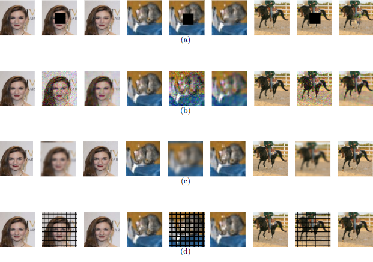

# Research

## ButterflyNet2D: Bridging Classical Methods and Neural Network Methods in Image Processing.
A neural network that can be initialized as a Fourier Transform Operator.
Arxiv Preprint.
<a href="https://github.com/Genz17/ButterFlyNet2D">[Code]</a>
<a href="https://arxiv.org/abs/2211.16578">[Paper]</a>

## Finite Expression Method for PDE Solving through Spectral Method
FEX through spectral method.
<a href="https://github.com/Genz17/FEXSpectrum">[Code]</a>

## Butterfly Algorithm in Discretization Invariant Learning

## Improvment to PINN
